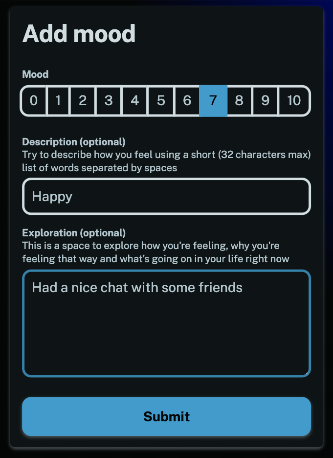

Welcome to the MoodTracker blog! I thought I'd start this so people can see what's been going on with the app.

Most recently we've added an exploration field that let's you add a proper journal entry with each mood you record.

You can use this space to explore how you're feeling, why you're feeling that way and what's been going on in your life.

Hope you enjoy the new feature and find it useful, take care and have a happy new year!
