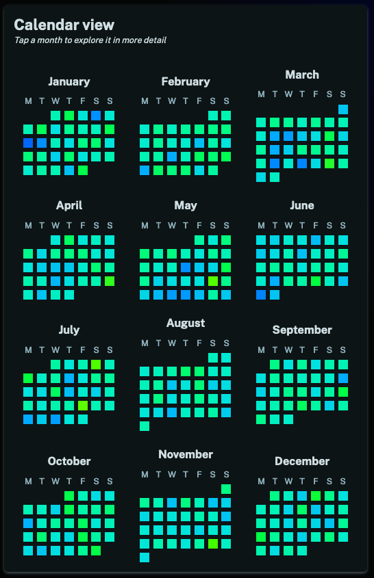

We've made a number of changes to your [stats pages](/stats).

First up we've added a year page which allows you to review your mood over the course of an entire year. The most interesting new visualization is the day-by-day calendar view:

We've made a number of other tweaks and enhancements too, for instance it is much easier to navigate around your stats now. All views are linked so it is easy to drill down from year to month to week and to drill up from week to month to year.

Hope you enjoy these new features and gain new insights from them!
