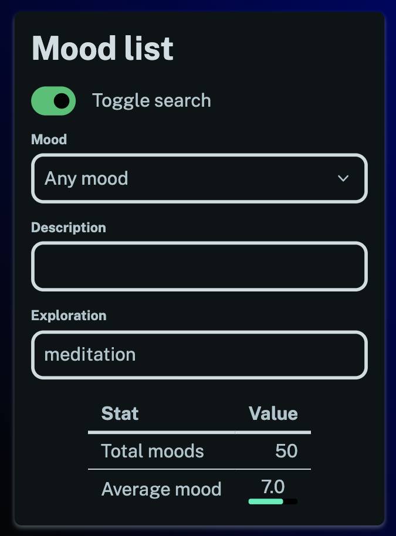

You can now search and filter through all your moods!

This can lead to some interesting insights. For instance:

- You can now review your best and worst moments.
- You can search for different activities you've logged in your explorations to see how they impact your mood (see the screenshot above). Filter through your hobbies and see what you most enjoy doing.
- You can even take a look at how you rank your different emotions on average by filtering the description field.

There are all sorts of possibilities here for exploring patterns in your emotional life.

You'll need to have a few moods logged before you can make use of this feature. When you have enough entries you'll see the search toggle and be able to get started on your [homepage](/).

Enjoy!
