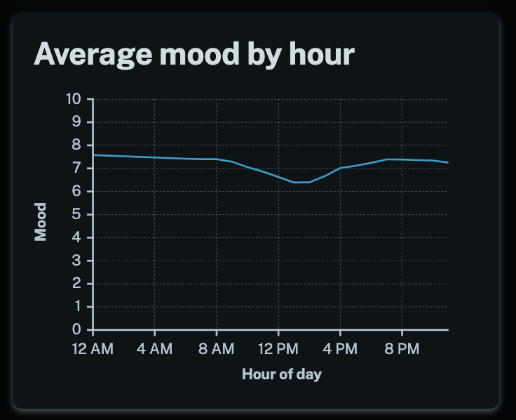

You can now see your average mood by hour on the weekly, monthly and yearly statistics pages.

This can give you insights about how the time of day impacts your mood. For instance, there's clearly an afternoon dip in this chart. With MoodTracker you can run experiments and see the results, perhaps trying different foods for lunch or getting more sleep at night can change the way you feel throughout the course of the day. MoodTracker makes it easy to discover what works best for you!

If you're signed in then [take a look at your stats here](/stats).
