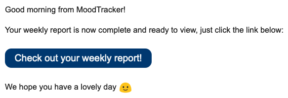

We've added a new [notifications page](/settings/notifications) where you can opt into weekly update emails. If you turn these notifications on then you will receive an email every Monday morning linking you to your weekly statistics page.

It's a nice opportunity to review and reflect on your last week and to think ahead to the one you've just begun.

We hope you find this feature useful and remember you can turn it off at any point if you no longer wish to receive the emails 🙂
