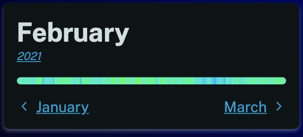
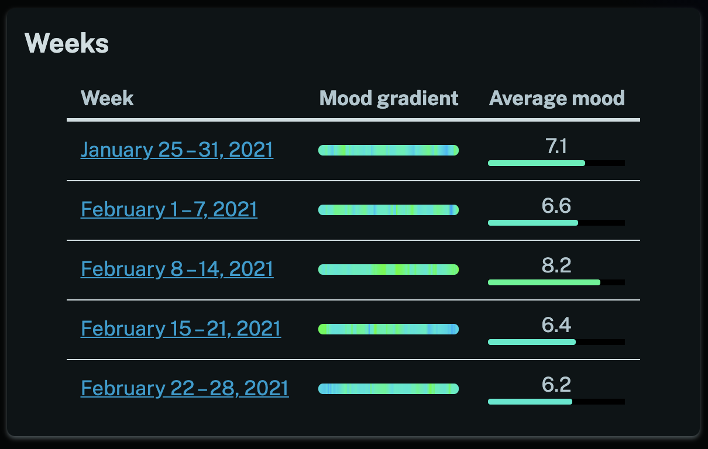

We've been making a lot of small improvements behind the scenes recently, you may have noticed some new changes to the navigation menu for instance. Today though we've added a new mood gradient visualization to your stats pages. You can now see at a glance what your week, month or year was like.

We've also added it to the [overview page](/stats) and month page. We think it makes it much easier to see what your week, month or year was like before you drill down to it.

We hope you enjoy this feature and find it useful!
