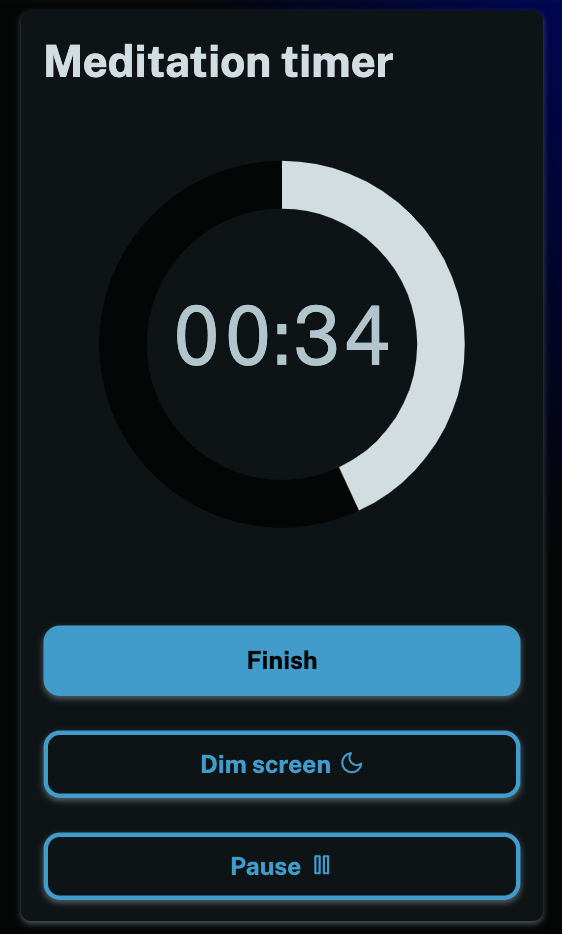

We've added a meditation timer to the app. If you're signed in you can check it out [here](/meditation). You can choose from preset times or set your own custom time. You can also pause the timer and dim the screen if you don't want to be disturbed.

This isn't a feature you'd typically expect to find in a mood tracking app, but we're experimenting with ways we can continue to help you learn about yourself and unlock your full potential.

Meditation has been demonstrated to have a positive impact on mood and wellbeing so we may continue to experiment with feature ideas like this (or even remove them if no-one uses them or finds them useful).

Have a lovely day!
