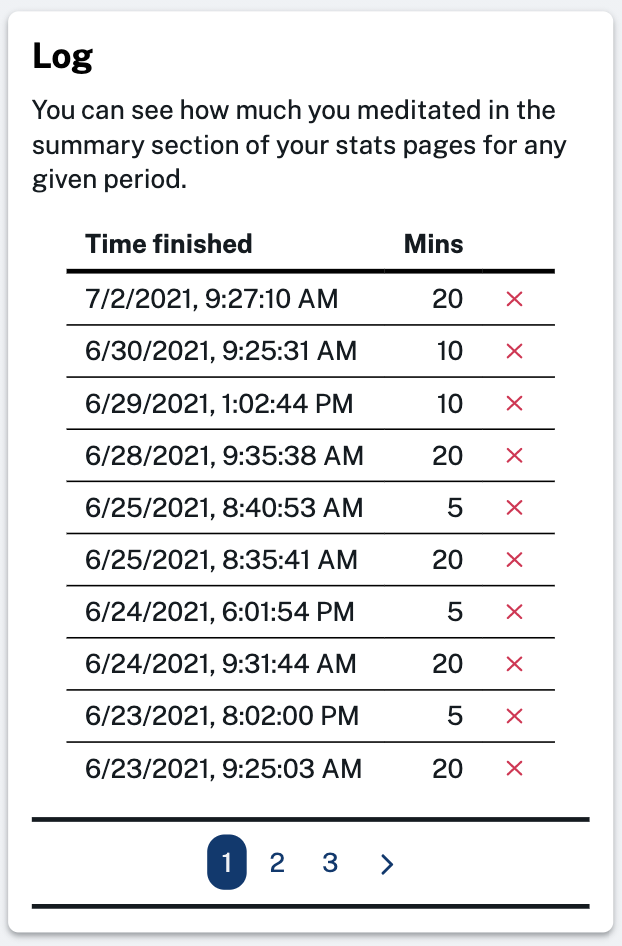
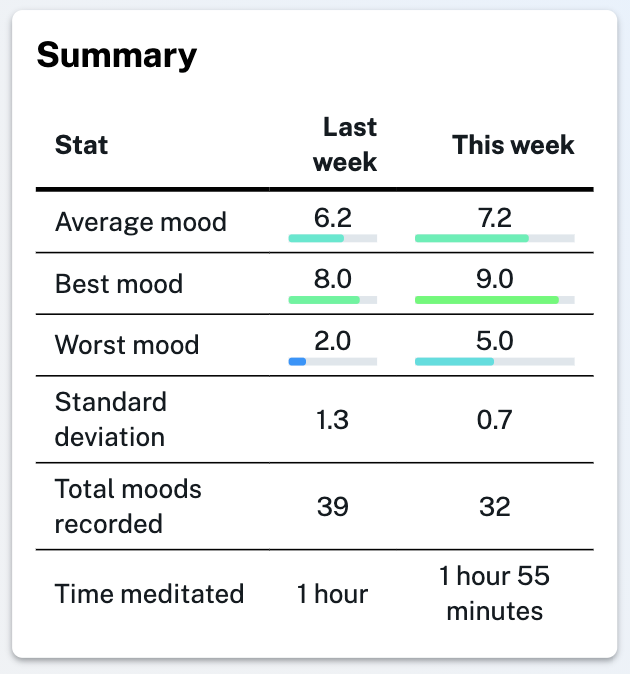

Well it's been a while since we last shipped any big new features, nevertheless we have been tinkering away in the background and today we have a new feature to announce!

Back in April we added a simple meditation timer, but since MoodTracker is a tracking app we've now added the ability to keep track of your meditation as well as your mood. After you complete a meditation you will have the option to add it to your meditation log:

If you start using the meditation feature you will then see how much you meditate when you check your summary on the stats pages for any day, week, month or year:

We're thinking about how we can meaningfully correlate these two data sets to bring new insights, but for now we hope you enjoy this new feature and find it useful!
