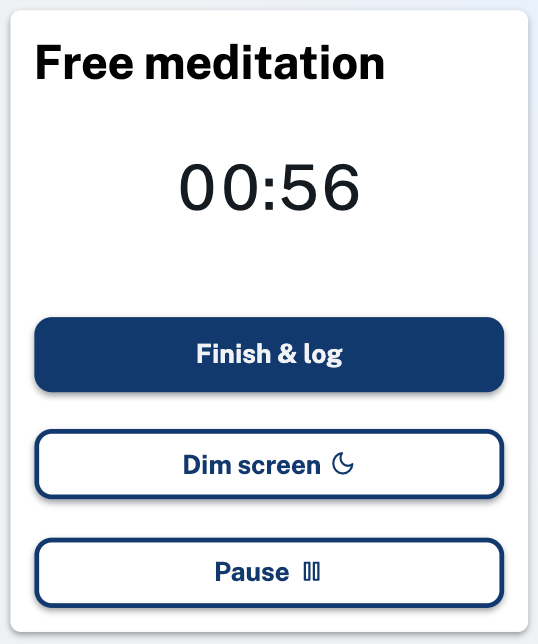

Up until now you've have to choose a time at the beginning of your meditation session and count down until the end. However, sometimes you don't know in advance how long you will practice for, so we've now added a open-ended meditation mode where you can start the clock and finish it whenever you are done.

If you're logged in you can find this option on the [meditate page](/meditation). You can still log these meditations and see all the associated stats. We hope you find this new feature useful!
