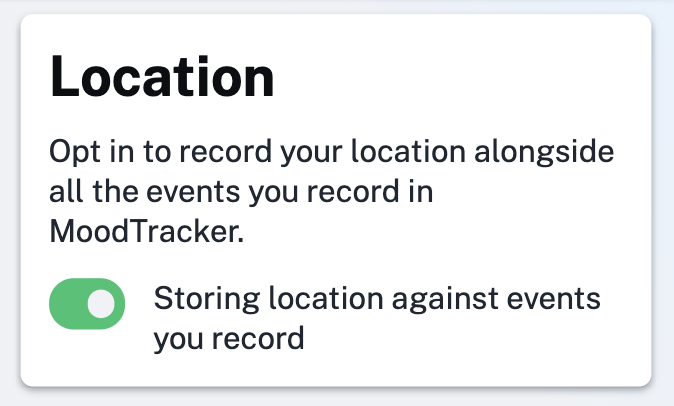

We've added a new feature that allows you to opt in to recording your location against all the events you record in the app. You can find it on the [location settings page](http://localhost:1234/settings/location) when you're signed in.

If you opt in then you will be able to see where you were for all your events and of course if you don't opt in the app won't track your location at all.

In the future we may create some useful visualizations with this feature to show where you have been and possibly correlate your mood to things like the weather.

Enjoy!
