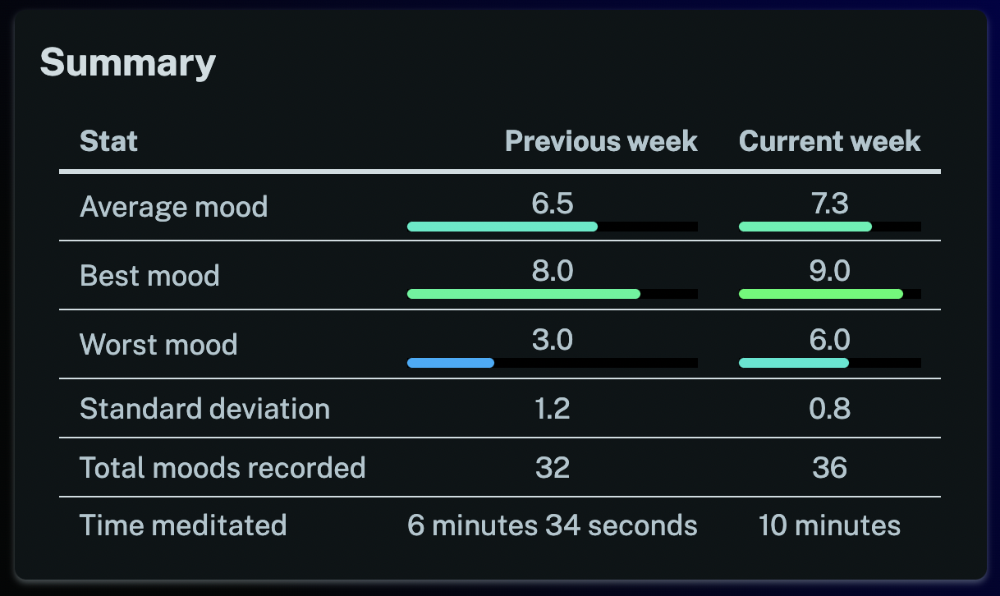
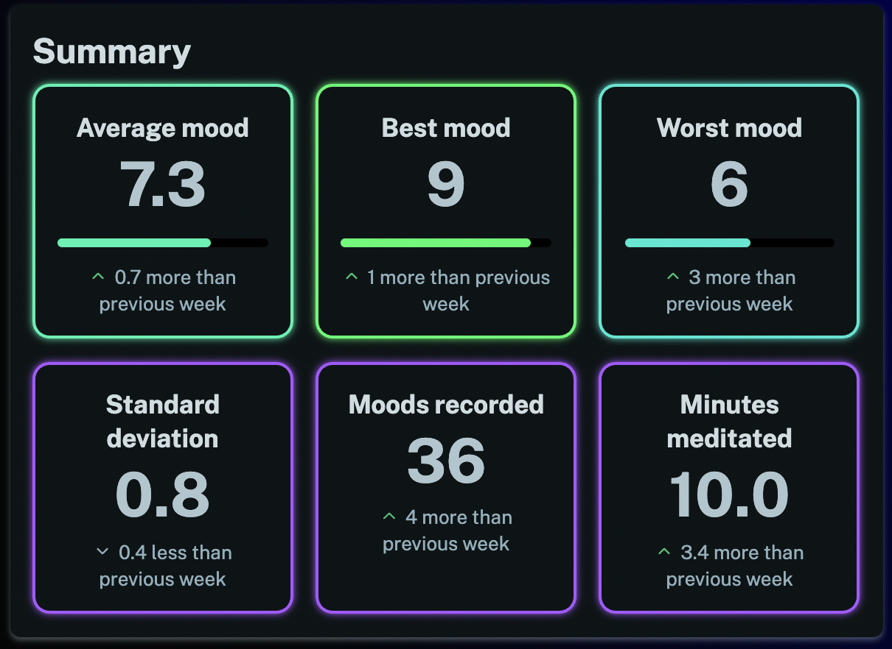

Hi there, it's been a while! We've been making minor tweaks, fixing bugs and keeping things up-to-date, but haven't had any major new feature releases for some time. However, today we've made a fairly noticeable change to the summary view on the stats pages which is worth highlighting.

This is what it used to look like:

And this is what it looks like now:

We've tried to make the current stats more obvious while also giving you some useful trend information. If you're logged in you can take a look at the new summary view by navigating to the [stats page](/stats) and following a link to one of the days, weeks, months or years.

Hopefully you find this new feature enjoyable and useful!
