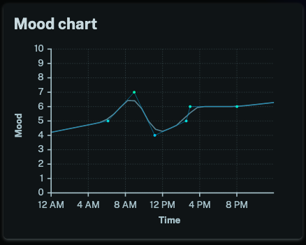

We've added a mood chart to the day view in the stats pages. This should be useful to anyone who adds multiple moods in a day, you can now very easily visualize your mood over time.

Here's an example:

Enjoy!
