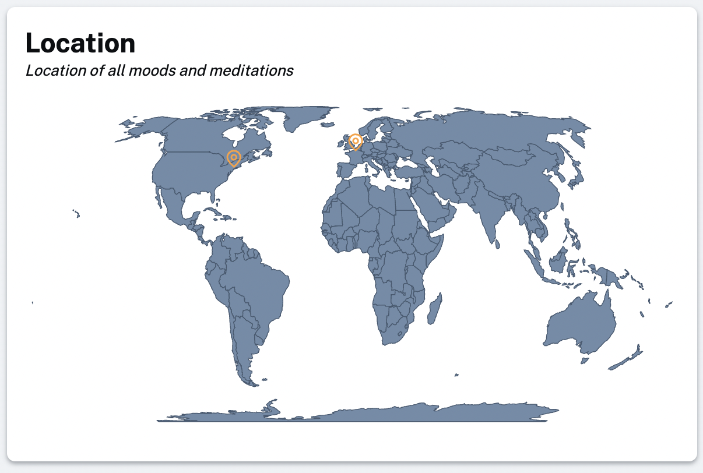

For a while now you've had the option to [turn on location recording](/settings/location) when you're signed in. We weren't doing a lot with this data and it was only displayed as latitude and longitude coordinates against your moods. Now though, we have added some basic maps to your stats pages and your pages for adding and editting moods.

Here's an example:

This map is only visible if you have have location recording turned on and if you have some locations recorded against your moods and meditations. Hopefully it gives a little more context to where you were when you were using the app.

Hope you enjoy! 🙂
