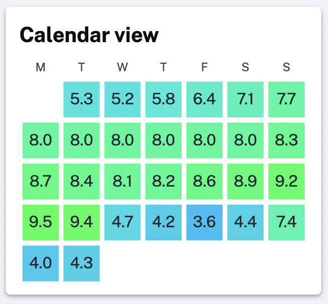
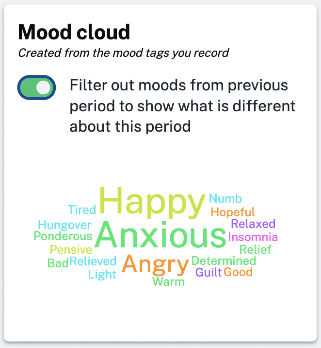

We've made a couple of changes that should hopefully give you some more insight on the stats pages.

Firstly we have added your average mood number for each day on the calendar view. Now instead of just looking at the color of each day and wondering what it means you can also see the underlying number:

And secondly we've added a toggle to the mood calendar when you review the stats for each period:

This allows you to filter out all the moods that were shared with the last period to see what has changed. In the example you can see that there is a lot of anxiety, happiness and anger in this period that wasn't there in the last one.

Hope you find these changes useful! 🙂
