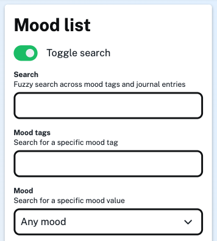
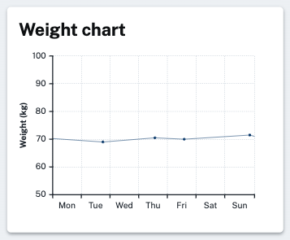

Long time no blog post! I've been doing all sorts of things in the background on this app. Most of the changes have been fairly minor, for instance the search functionality is improved and utilizes a "fuzzy" approach:

Another thing I added was the ability to track your weight. Mostly because I wanted to do it for myself. If you're signed in, you can [add your weight here](/weight/add) and view weight charts on your [stats pages](/stats):

More things are in the works. I'm not always updating this blog but I am still enjoying tinkering around with the app and adding new functionality. If you're so inclined you can always see a [full technical change history over on GitHub](https://github.com/benji6/moodtracker/commits/master).

Enjoy!
