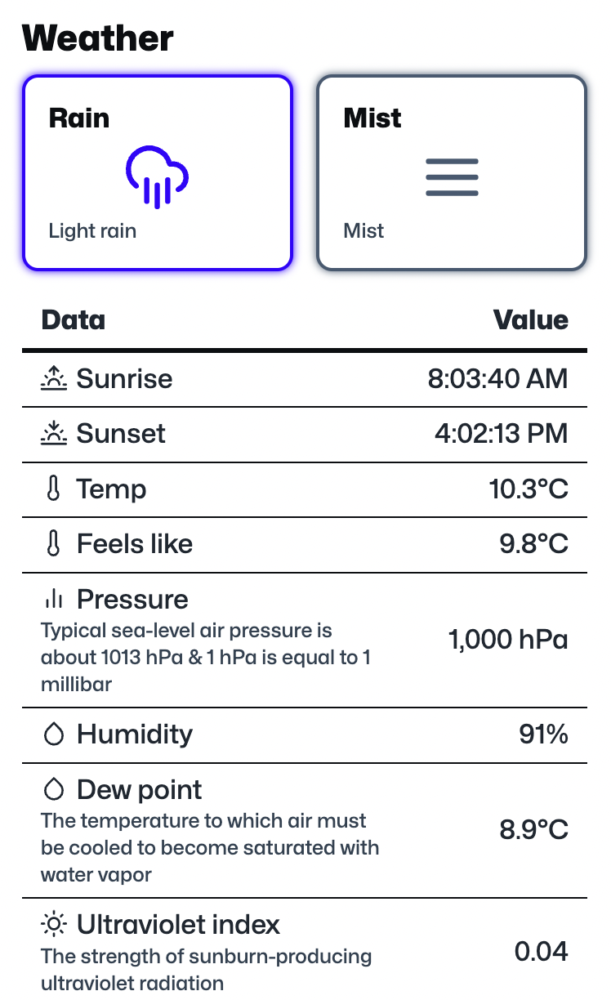
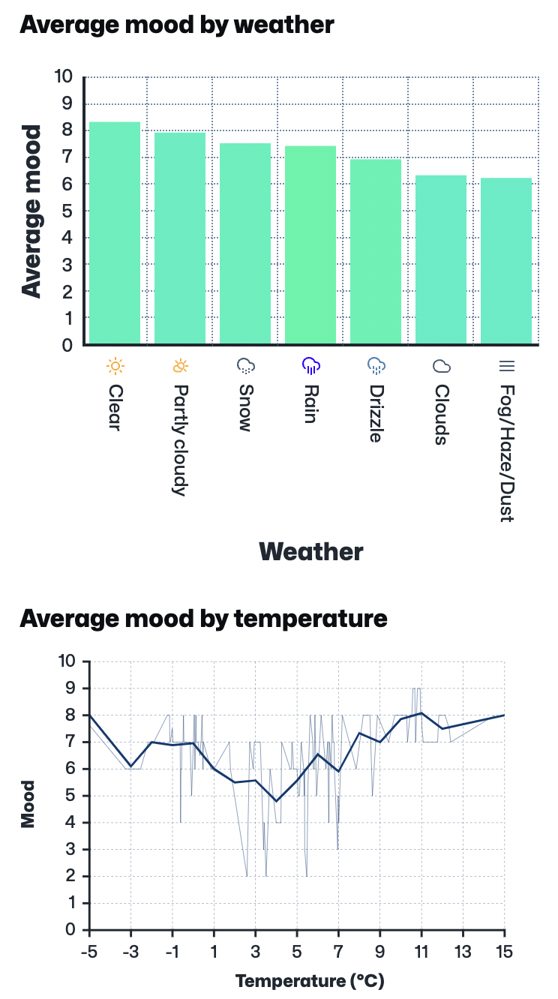

For some time now you've been able to record your location against anything you record in MoodTracker. This functionality can be configured on the [location settings page](/settings/location) when you're signed in. Now MoodTracker can fetch the weather for each location and time where you recorded something.

You can see this data when you [add](/add) or edit moods (or anything else) when you're signed in:

You can also see some new graphs on the various [stats pages](/stats) when you're signed in. Here are a couple examples:

Mood and weather seem quite entwined. Sometimes we use the same words to describe both things (e.g. weather and mood can both be "miserable" or "bright"). And there is a lot of evidence that [seasons can impact mood](https://en.wikipedia.org/wiki/Seasonal_affective_disorder).

I was curious to see how the weather impacted my mood which is why I added this feature. And I was both surprised and interested to see it doesn't really impact it that much! How about you?

I hope you enjoy this feature!
