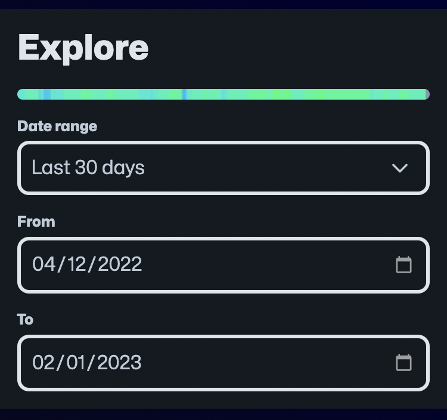
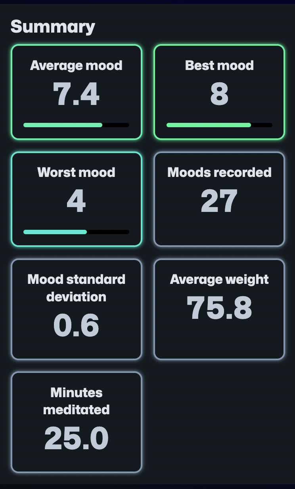

I've made a few changes to the [Explore](/stats/explore) page recently that should hopefully make it more useful. Firstly, I've added a date range dropdown which allows you to select some common time ranges (e.g. 7 days, 30 days, 90 days, or even everything):

I've also added a summary panel (like you get on all the other stats pages):

And lastly, I've refined the selection of charts on the page.

I hope this makes it even easier to review the data you collect with MoodTracker.
