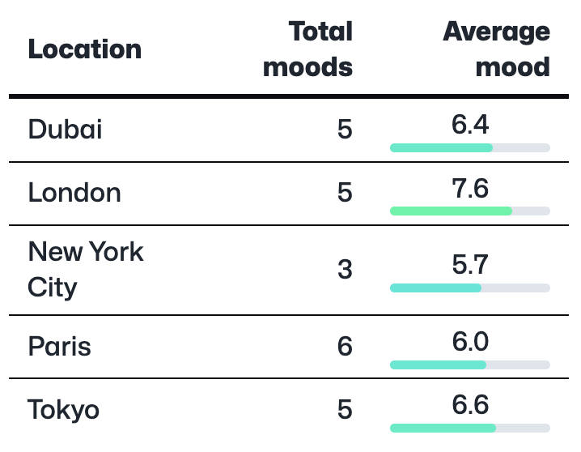

If you're recording your location against your events you can now see a place name (e.g. London, Paris etc) in many of the places where MoodTracker used to show you latitude and longitude.

This should be a bit more meaningful and has enabed the development of a new visualization that shows a breakdown of your mood based on location in the various [stats pages](/stats):

Enjoy!
